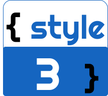

<h1 align="center">
    
</h1>

<h1 align="center">ProgramFlix</h1>

Recriando a tela da Netflix como catálogo de informações sobre linguagens de programação

<!-- Os 2 modelos abaixo são exemplos de como inserir badge

  

 -->

<h1 align="center">
    
</h1>

<h2 align="center">📇Guia</h2>

    •
    <a href="#checklist">Chesklist</a> •
    <a href="#pré-requisitos">Tecnologias</a> •
    <a href="#tecnologias">Principal aprendizado</a> • 
    <a href="#dificuldades">Dificuldades</a> •
    <a href="#autor">Autor</a>

<h4 align="center">🔨 O projeto está sendo refinado 🔨</h4>

# 🗹 Checklist

- [x] Arquivos de exibição e estilização
- [x] Adicionar Link de configuração do Font Awesome
- [x] Criar estrutura HTML
- [x] Estilizar a estrutura
- [x] Adicionar e configurar o Owl Carousel
- [x] Adiconar imagem nos cards
- [x] Criar dinâmica para mudar o banner ao clicar no card com JS
- [x] Adicionar detalhes ao clicar para ler uma mais sobre uma linguagem (Parcialmente concluído)
- [] Adicionar efeito de transição ao acionar evento no JavaScript

# ⌨️Tecnologias

- HTML / CSS / JavaScript
- Font Awesome
- Owl-Carolsel

# ✨Principal aprendizado

- Navegação e manipulação de atributos, conteúdos, estilos, elementos e eventos.

# 🚧Dificuldades

- Usar JavaScript para modificar o conteúdo sem deixar sujeira na DOM
- Acionar o evento para o card correto em meio a diversos

<h1 id="autor">👨‍💻Autor</h1>

<h2>Jayneanderson Santos</h2>

Aceita um café? Me mande uma mensagem.

 
 
